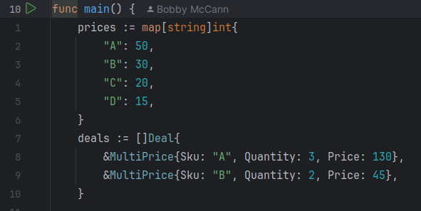

# Shopping Cart Calculator

## How to run

This program accepts SKUs from standard input. Each line should contain a single SKU.
On end of file, the program will print the total price of the cart.

First, build the executable with:

```bash
go build
```

I've included a sample input file that you can test like so:

```bash
cat example.txt | ./ThinkMoneyCheckout
```

Alternatively you can type in items interactively, then press CTRL+D to send an EOF.

## Running tests

```bash
go test cart/cart_test.go
```

## Adding new SKUs and deals

SKUs and deals are defined in two slices in `main.go`. You can add new SKUs and deals by adding to the arrays.



You can also implement different types of deals, so long as they implement the `Deal` interface defined in `cart.go`.
